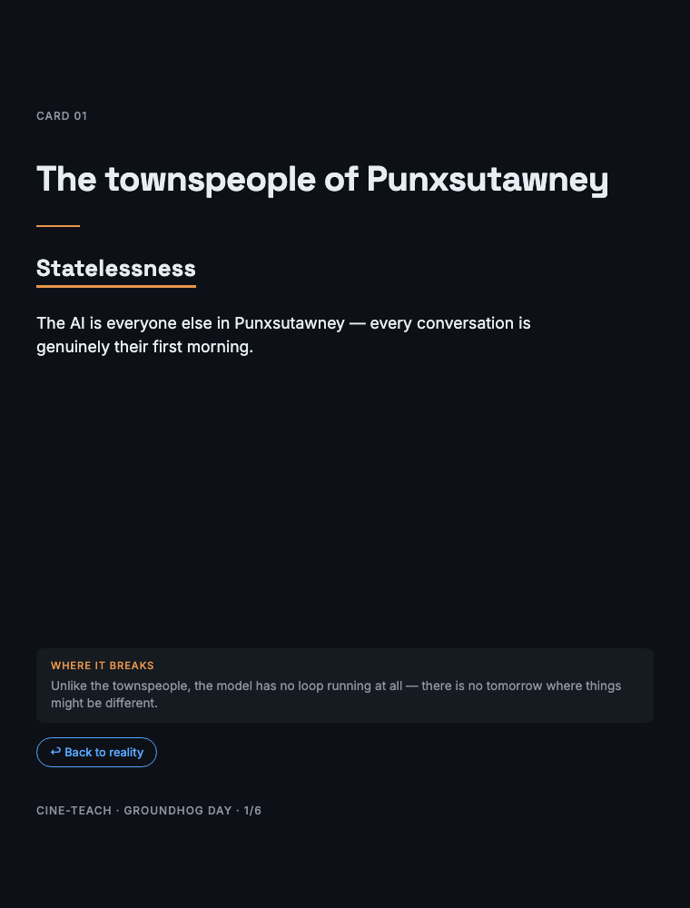

# cine-teach

Map any technical concept onto any movie. One concept, one scene, one card.



*From the example deck [Groundhog Day × AI Agent Memory](examples/groundhog-day-agent-memory/) —
6 cards, rendered with `scripts/render.py`.*

---

## What it does

cine-teach takes a set of technical concepts and a movie the audience already knows,
then produces a visual card deck where each card pairs one concept with one movie
moment — designed for three-second comprehension on a social feed and lasting
retention.

Every card has four zones: **movie anchor** (the hook), **concept label** (the new
idea), **mapping line** (the one-sentence bridge), and **break tag** (where the
analogy stops being true). The break tag is what makes this pedagogically honest
rather than just clever.

## Why

Technical concepts stick when mapped onto narrative structures people already hold in
long-term memory. The problem: most "explain X using Y" content forces analogies that
sound good but teach false models. The learner carries the wrong intuition forward
and nobody told them where the metaphor stopped.

cine-teach forces three things that casual analogy-making skips:

1. **Mechanism matching** — the movie element must *behave* like the concept, not just
   sound like it.
2. **Mandatory breakage disclosure** — every mapping states where it stops being true.
3. **Bridge back to reality** — a sentence that connects the movie intuition to the
   real technical mechanism, so the learner does not get stuck in the metaphor.

## The output is the product

The shareable card deck is not a byproduct of analysis — it is the deliverable. Each
deck can be exported as:

- **HTML** — a single self-contained file with scroll-snap navigation. Host on GitHub
  Pages, share as a link.
- **PNG set** — individual card images at social-media-native resolutions (1080×1350
  for Instagram/LinkedIn, 1600×900 for X/Twitter).
- **PDF** — the full deck as a downloadable document with bridge sentences visible.

## Architecture

Three stages:

```
Source material + Movie title
        │
        ▼
  ┌─ Extract ─┐    Identify distinct concepts from the source
  └────┬───────┘
       │  concepts.json
       ▼
  ┌── Map ────┐    For each concept, find the best movie element,
  │           │    score the mapping, identify breakage, write the bridge
  └────┬──────┘
       │  mapping.json
       ▼
  ┌─ Render ──┐    Produce the card deck (HTML → PNG → PDF)
  └───────────┘
```

The **mapping JSON** is the interchange format. Anyone can write a custom renderer —
a different visual style, an animated version, a Keynote deck — without touching the
mapping logic.

## Install (Claude Code)

This repo is a Claude Code plugin and its own marketplace. Inside Claude Code:

```
/plugin marketplace add FrancyJGLisboa/cine-teach
/plugin install cine-teach@cine-teach
```

The `cine-teach` skill then activates automatically on phrases like
"explain using a movie", "map this to [movie]", or "cine-teach this".

Validate the packaging any time with:

```
claude plugin validate . --strict
```

## Skill folder

The `SKILL.md` and `references/` directory contain the full rule set that governs
concept extraction, analogy quality control, breakage classification, and card
design. This is an AI-native skill — it is designed to be loaded into an LLM context
so the model follows the rules when generating mappings.

```
cine-teach/
├── .claude-plugin/
│   ├── plugin.json                       # Plugin manifest
│   └── marketplace.json                  # Marketplace manifest (repo self-hosts)
├── skills/
│   └── cine-teach/
│       ├── SKILL.md                      # Core rules: extract → map → render
│       └── references/
│           ├── analogy_rubric.md         # 4-dimension scoring (mechanism fidelity,
│           │                             #   recognizability, breakage clarity,
│           │                             #   caption writability)
│           ├── card_schema.md            # JSON interchange format
│           ├── card_design.md            # Visual design system: palette, type, layout
│           └── breakage_taxonomy.md      # 8 categories of analogy failure
├── scripts/
│   └── render.py                         # Stage 3: mapping.json → HTML deck (stdlib only)
├── examples/
│   └── groundhog-day-agent-memory/       # First complete deck: mapping.json + deck.html
└── README.md
```

Render any mapping to a deck:

```
python3 scripts/render.py examples/groundhog-day-agent-memory/mapping.json
```

The script enforces the schema's quality gates (mechanism fidelity ≥ 3, overall ≥ 3.0,
mandatory break points and bridges) and refuses to render a deck that fails them.

## Quality gates

A mapping enters the rendered deck only if:

- **Mechanism fidelity ≥ 3** — the movie element actually behaves like the concept
- **Overall score ≥ 3.0** — across all four rubric dimensions
- **No surface-only mappings** — if the correspondence is just naming, it is
  classified as unmapped and gets a direct explanation instead

Concepts with no viable mapping appear on the **Limits Card** — "Where the analogy
ends" — which tells the learner explicitly which ideas are genuinely new and not
reducible to something they already know.

## Status

Building in public. Current state:

- [x] Skill folder: core rules, scoring rubric, schema, design system, breakage
  taxonomy
- [x] Plugin packaging (`.claude-plugin/`), installable via `/plugin`
- [x] HTML card renderer (`scripts/render.py`, stdlib-only, validates quality gates)
- [x] First complete example deck (Groundhog Day × Agent Memory)
- [ ] PNG export via Playwright
- [ ] PDF export
- [x] GitHub Pages hosting for example decks — https://francyjglisboa.github.io/cine-teach/
- [ ] Eval suite: 5 movie × topic combinations tested against the rubric

## License

MIT
